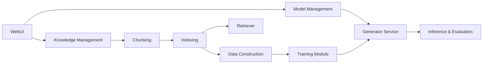
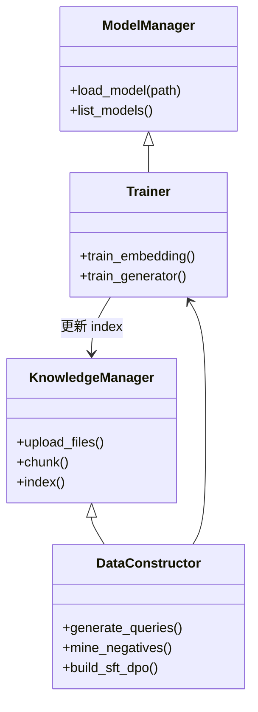

# UltraRAG 分析报告（中文）

## 1. 标题
UltraRAG: A Modular and Automated Toolkit for Adaptive Retrieval-Augmented Generation

## 2. 核心问题（Core Problem）
- 现有的 RAG 工具箱在真实场景下存在几个不足：
  - 缺乏针对具体领域（例如法律、金融等）的知识适配能力；
  - 很多工具复杂、难以定制，且缺乏易用的界面；
  - 不同模块（检索、重排序、生成、评估）协调与自动化不足；
  - 对于多模态（文本 + 图像等）支持及端到端流水线支持不足。

## 3. 解决方案（Proposed Solution）
- 提出 UltraRAG：一个面向知识适配的模块化 RAG 工具箱，覆盖从知识库管理、自动数据构造、训练到评估与推理的全流程；
- 提供可视化 WebUI，降低使用门槛；支持多模态输入、模型管理、本地部署（如通过 vLLM 或 Ollama）、知识管理与索引；
- 自动化知识适配流程：通过数据构造模块自动合成训练与评估数据（包括检索对、Hard Negative、SFT、DPO 对），对检索器与生成器进行微调；
- 支持多种训练策略（SFT、DPO + LoRA），以及多种推理工作流（VanillaRAG、DeepNote、RAGAdaptation 等）。

## 4. 关键结果（Key Results）
- 在法律领域（LawBench）实验中进行了知识适配示例：
  - 检索性能（表 3）：UltraRAG-Embedding 在 Finetune 前后提升——MRR@10: 36.46 -> 37.57；NDCG@10: 40.05 -> 42.12；Recall@10: 54.50 -> 56.50；
  - 生成性能（表 4）：在 Law Prediction 与 Consultation 任务中，使用 KBAlign / DDR / RAGAdaptation 都显示出比 VanillaRAG 明显更好的 ROUGE-L 分数，比如 Law Prediction：VanillaRAG 40.75 -> DDR 53.14（相对提升显著）；Consultation：VanillaRAG 23.65 -> RAGAdaptation 25.85。
- 案例分析（Table 5）：UltraRAG 在法律场景中能更准确地引用法律条文，比 VanillaRAG 更能给出针对性的法条引用（如案例中从错误引用 Article 38 纠正为 Article 32）。

## 5. 重要性（Significance）
- 大幅降低了构建行业场景下 RAG 系统的门槛；自动化的知识适配流程能帮助 LLM 在特定领域内减少幻觉并提升准确性；
- 提供端到端与可视化工具，有利于快速迭代、对比实验与复现，并增强落地生产的可行性；
- 在多模态场景下也提供支持，扩展了适用范围。

---

## 方法论分析（Methodology Analysis）

### 算法/模型（Algorithm/Model）
- 模块化架构：Global (Model Management、Knowledge Management) + Functional (Data Construction、Training、Evaluation & Inference)；
- 核心实现方法涵盖：检索器（embedding-based dense retriever）、重排序（reranker）、生成模型（生成 LLM），并支持系列训练策略（SFT、DPO、LoRA）；
- 数据构造采用合成查询、Hard Negative 挖掘、构造 SFT 和 DPO 训练对；引入规则化 reward 生成偏好对用于 DPO；
- 多种推理流程：VanillaRAG（检索后生成）、UltraRAG-DeepNote（动态记忆/迭代更新检索上下文）、RAGAdaptation（使用经过领域微调的模型）。

### 数据集（Dataset）
- 提供 40+ 常用基准数据集，论文中以法律场景为例使用 LawBench，知识库来自 >1000 部法律相关图书（覆盖民法、刑法、判例等）；
- 实验用 MiniCPM-Embedding-Light 作为 embedding 模型，MiniCPM-3-4B 作为生成模型；
- 数据构造模块自动生成训练样本（例如检索 finetune 的 2800 样本）。

### 对比基线（Baselines）
- LangChain、LlamaIndex、XRAG、FastRAG、RAGLab、LocalRQA、FlashRAG 等工具箱；
- 实验中比较 VanillaRAG、KBAlign、DDR、RAGAdaptation 和 DeepNote 等推理/训练方法。

### 评估指标（Metrics）
- 检索：MRR@10、NDCG@10、Recall@10；
- 生成：ROUGE-L（表 4）；
- 还进行 GPT-4o 标注样本评估（用于检索样本质量验证）。

---

## 创新与批判（Innovation & Critique）

### 新颖点（Novelty）
- 在 RAG 工具链中将“知识适配”流程端到端自动化，结合数据构造、嵌入微调、生成微调（SFT/DPO/LoRA）以提升领域适配能力；
- 提供对多模态与可视化 WebUI 的一体化支持，降低工程/部署门槛，同时包含评估工具与大量 benchmark 接入；
- 将多种先进方法（DDR、KBAlign、DeepNote）集成并可复现、对比，强调可扩展性与端到端评估一致性。

### 优势（Strengths）
- 全流程覆盖，从知识库接入、索引构建、数据生成到训练、评估与推理；
- 自动化程度高，尤其对非专业开发者友好（WebUI）；
- 支持本地部署、API 模式以及多模态，具备较好的工程化落地能力；
- 提供统一数据格式和大量数据集，便于复现实验与公平对比。

### 局限与缺点（Weaknesses/Limitations）
- 论文侧重工程体系和能力集成，算法创新性相对有限，主要是工具链整合与自动化；
- 实验主要聚焦法律场景，缺乏跨多个领域（如医学、金融、知识检索等）的广泛对比；
- 对模型选择、超参、数据合成策略与微调范式的细粒度 ablation 仍然较少；
- 生成质量评估主要依赖 ROUGE-L，尚需更多人类评估或更严谨的自动化事实性评估指标；
- 可解释性和检索质量的分析尚不充分（如错误检索来源、负样本质量分析）。

### 未来工作（Future Work）
- 扩展跨领域实验，系统化地验证知识适配对不同领域（金融、医疗、科技）的提升幅度；
- 提供更完整的 ablation（数据构造策略、LoRA、DPO、检索器/重排序组合等）；
- 加强对生成模型事实性与可信度的评估（使用更丰富的自动与人工评估）；
- 对检索效率与规模化能力（大规模知识库、低延迟部署）做更深入的工程评估；
- 支持更多的 embedding/retriever 引擎（如近似 NN、向量数据库优化、跨语言适配）。

---

## 代码实现指南（Code Implementation Guide）

### 关键模块（Key Classes / Functions）
- ModelManager：管理本地/API 模型加载、部署与初始化（支持 vLLM、Transformers、Ollama）；
- KnowledgeManager：接收多种知识源（TXT、PDF、Markdown、JSON、CSV）、文本分块、编码与索引（FAISS / HNSW 等）；
- DataConstructor：自动合成查询、构建检索样本/负样本、SFT/DPO 样例生成、偏好对合成；
- Trainer：微调 embedding 与生成模型（SFT、LoRA + DPO），保存与验证模型 checkpoint；
- Evaluator：统一评估接口（支持 Recall/MRR/NDCG/ROUGE-L 等）；
- InferenceEngine：管理不同推理工作流（VanillaRAG、DeepNote、RAGAdaptation）并支持流式输出；
- WebUI Controllers：上传/查看知识库、配置模型、监控训练/推理。

### 依赖（Dependencies）
- 核心：pypdf、transformers、vLLM、faiss/annoy/hnswlib、huggingface_hub、peft（LoRA 支持）、torch；
- 工具/UI：FastAPI / Flask + React/Streamlit 等用于 WebUI；
- 其他：sentence-transformers / OpenBMB 提供的 embedding 模型、xformers（加速）、LoRA/PEFT 工具。

### 伪代码（Pseudocode）
```
# 知识管理
kb_files = upload_files()
chunks = chunk_documents(kb_files, size=512, overlap=0.15)
index = build_index(chunks, embed_model)

# 数据构造
queries = generate_queries_from_docs(chunks)
pos_neg_pairs = mine_hard_negatives(queries, index)
sft_pairs, dpo_pairs = build_sft_dpo_pairs(queries, pos_neg_pairs)

# 训练
embedding_model = finetune_embedding(pos_neg_pairs)
generator_model = sft_train(generator_model, sft_pairs)
# 使用 DPO + LoRA 进一步优化
generator_model = dpo_finetune_with_lora(generator_model, dpo_pairs)

# 评估
r, ndcg = evaluate_retrieval(embedding_model, eval_set)
rouge = evaluate_generation(generator_model, eval_set)

# 推理
workflow = select_workflow("RAGAdaptation")
result = run_inference(workflow, query, index, generator_model)
```

---

## 深度分析与可视化（Deep Analysis & Visualization）

### 1) 执行摘要（Executive Summary）
- 问题：如何在真实业务场景中，通过自动化流程构建面向领域的 RAG 系统以减少幻觉并提升事实性？
- 贡献：提出 UltraRAG，一个面向知识适配的端到端 RAG 工具箱，自动化数据构造到微调，并提供 WebUI 与多模态支持；
- 影响：对行业化 RAG 应用（如法律问答）具有显著价值，可加速模型落地与复现。

### 2) 技术架构（Technical Architecture）


### 3) 数学与理论基础（Mathematical & Theoretical）
- DPO loss（Direct Preference Optimization）核心思想：把偏好比较对 (r+, r-) 转换为对数概率差的优化目标以模拟回报信号；
- 尺度指标：通常基于检索相关性度量（MRR, NDCG）和生成质量（ROUGE-L），以及人工注释或模型评估来判断生成事实性。

### 4) 实验分析（Experimental Analysis）
- 数据集：LawBench 为主要评估场景；知识库来自 >1000 法律相关书籍；
- 结果对比（简要表）：

| 项目 | VanillaRAG | KBAlign | DDR | RAGAdaptation |
|---|---:|---:|---:|---:|
| Law Prediction (ROUGE-L) | 40.75 | 48.72 | 53.14 | - |
| Consultation (ROUGE-L) | 23.65 | 24.62 | - | 25.85 |
| MRR@10 (Embedding) | 36.46 | - | - | 37.57 (w/ finetune) |

- 样例再现：表 5 的案例展示 UltraRAG 在领域适配后能引用更准确的法条，体现了知识适配的实际价值。

### 5) 批判性讨论（Critical Discussion）
- 优点：有效集成并工程化了知识适配流程，实用且可复现；
- 缺点：在更多领域和更大规模知识库下的泛化性与效率评估仍需补充；
- 开放问题：数据合成策略对最终性能的影响；模型选择（embedding & generator）与索引机制对检索质量的敏感性。

### 6) 实现路线图（Implementation Roadmap）


---

## 总结（Conclusion）
- UltraRAG 是一个面向知识适配、模块化、端到端的 RAG 工具箱，重点在工程化、自动化的知识构建与模型微调流程；
- 在法律场景实验中验证了知识适配的实用性：提升检索和生成性能、减少模型错误引用；
- 后续建议扩展跨领域实验、补充更严格的评估、并提供更多 ablation/可解释性分析以完善工具链。


---

*本分析报告基于仓库中 `docs/UltraRag.pdf` 的文本抽取生成，全文中文化并以工具箱模板输出。*